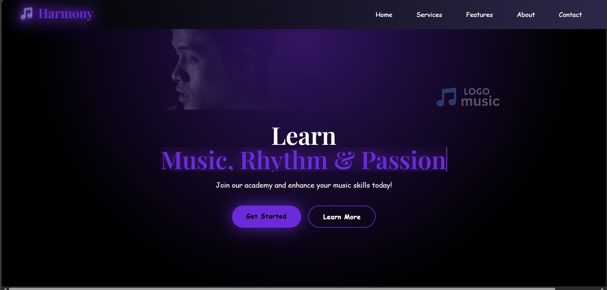
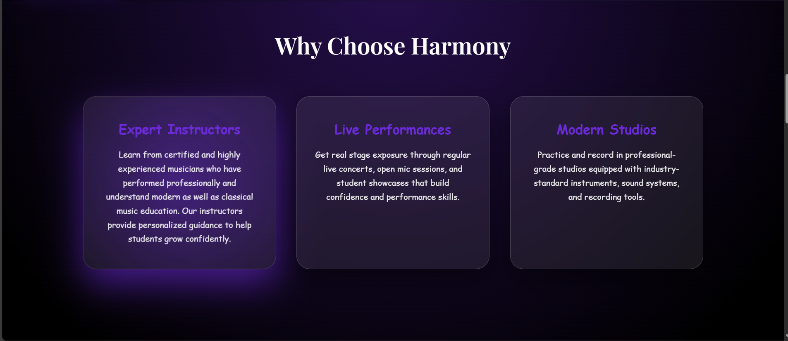
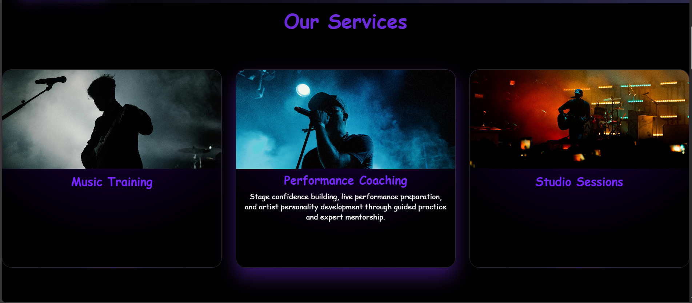
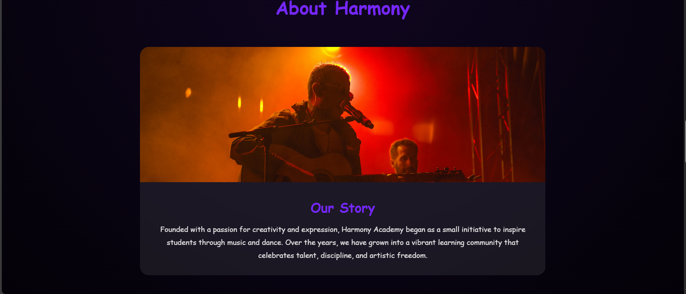

# 🎵 Harmony Music Academy Website

Welcome to the **Harmony Music Academy Website** repository! 🎶  
This project is a **modern, responsive website** designed for a music academy to showcase **courses, instructors, events, and contact information**. Explore the features and see how the academy inspires students to pursue their passion for music. 🎹🎸🎤

---

## 🖥️ Live Demo

Check out the live site here: [🔗 View Website](https://music-academy-website.netlify.app/)

---

## 📖 Table of Contents

1. [About the Project](#about-the-project)  
2. [Features](#features)  
3. [Technologies Used](#technologies-used)  
4. [Installation](#installation)  
5. [Screenshots](#screenshots)  
6. [Project Structure](#project-structure)  
7. [Roadmap](#roadmap)  
8. [Contact](#contact)  
9. [Acknowledgments](#acknowledgments)

---

## 📜 About the Project

This website is designed to:  

- **Showcase the academy’s courses** and learning programs  
- **Highlight instructors and events** for prospective students  
- **Provide a contact form** for inquiries and admissions  
- **Deliver an engaging user experience** with smooth navigation and modern UI  

Perfect for music students, parents, or anyone interested in learning music online or offline.

---

## ✨ Features

- 🎼 Responsive design for desktop, tablet, and mobile devices  
- 🎹 Sections for courses, instructors, events, and academy information  
- 🖼️ Image gallery to showcase events and activities  
- 📬 Contact form for inquiries  
- ⚡ Smooth scrolling and animations for engaging UI  
- 🖤 Clean and professional design  

---

## 🛠️ Technologies Used

- HTML5  
- CSS3 (with animations)  
- JavaScript  

---

## 📸 Portfolio Screenshots

### Landing Page

### Features Section

### Services Section

### About Section

### Contact Form

---

## 🏗️ Project Structure

music-academy-website/
│
├── index.html         
├── css/
│   └── style.css   
├── js/
│   └── script.js       
├── images/
│   └── (all project images)
└── README.md           

---

## 🚀 Roadmap

### Current Features
- Fully responsive layout across all devices
- Smooth animations for better user experience  
- Secure contact form handling  

### Upcoming Improvements
- Dark mode toggle 🌙 for a comfortable viewing experience  
- Blog section 📝 to share tutorials and insights  
- Multilingual support 🌎 to reach a wider audience  

---
 ## 📬 Contact

Feel free to reach out to me:

- **Email:** [jayavgune18@gmail.com](mailto:jayavgune18@gmail.com)  
- **LinkedIn:** [Connect with me](https://www.linkedin.com/in/jay-avgune/)  
